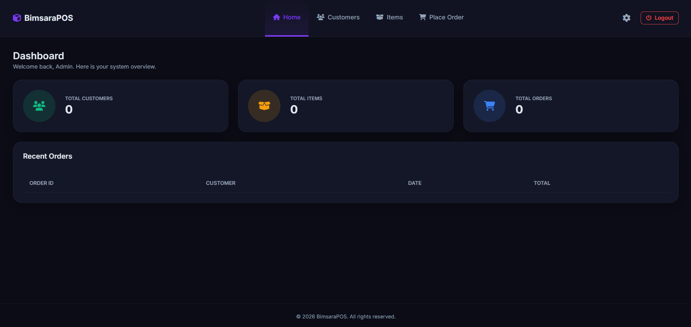
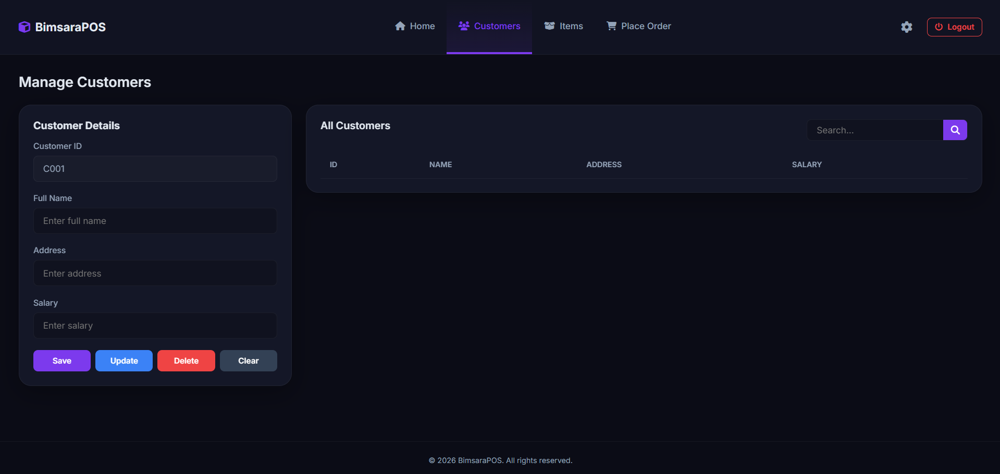
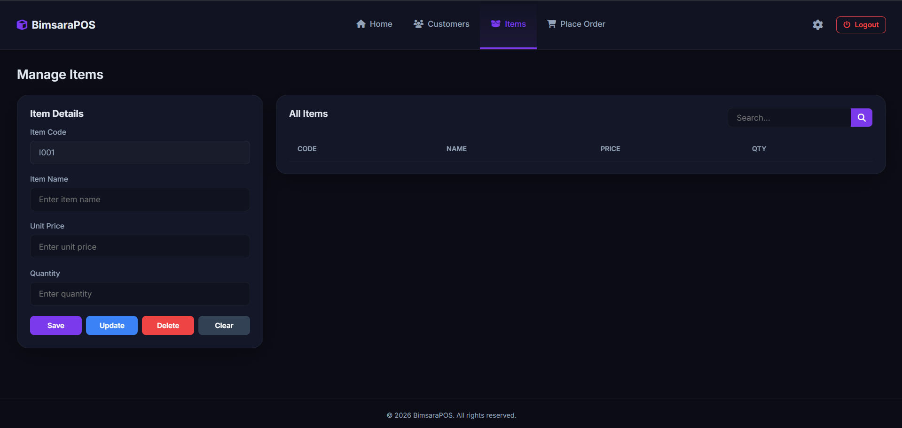
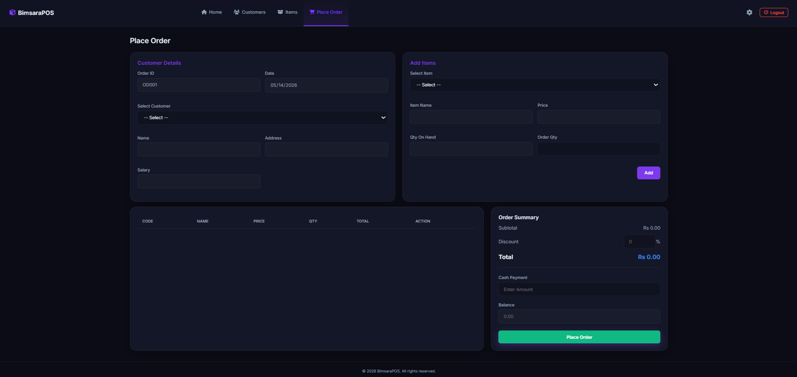
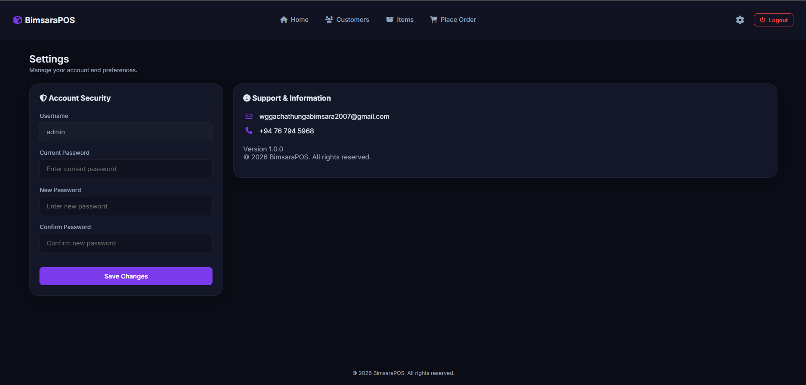

# Web POS System (ITS1119-Web-Technologies-Exercise 07)

A comprehensive Web-based Point of Sale (POS) system built using HTML, CSS, and JavaScript. This Single Page Application (SPA) allows users to manage customers, inventory items, process orders, and view dashboard analytics seamlessly.

## 🔗 Project Links

* **SideMap:** [GlooMaps](https://www.gloomaps.com/pcWv6PWTPJ)
* **Wireframe:** [Diagrams.net](https://app.diagrams.net/#G1PZ6JUUT74EMLNz-wiEq_1ERfYKzGuc57#%7B%22pageId%22%3A%22eC2EMZS12iNzHA-MmfUX%22%7D)
* **Mockup:** [Figma Design](https://www.figma.com/design/9RJLLOl3wURAjwjV6WCsJI/POS-System?node-id=0-1&p=f&t=uALZG3k9FXCuqlGU-0)
* **Live Demo:** [GitHub Pages Live](https://chathunga2007.github.io/ITS1119-Web-POS-System/)

## 📸 Screenshots & Features

### 🔐 Login
Secure login interface to access the POS system.

### 📊 Dashboard
Overview of the system with quick insights and analytics.

### 👥 Customer Management
Add, update, delete, and search for customer details efficiently.

### 📦 Item Management
Manage product inventory, including pricing and stock levels.

### 🛒 Order Management
Process new orders, select customers, add items to the cart, and complete checkouts.

### ⚙️ Settings
System configurations and user preferences.

## 🛠️ Technologies Used

* **Frontend:** HTML5, CSS3, Vanilla JavaScript
* **Architecture:** Single Page Application (SPA)
